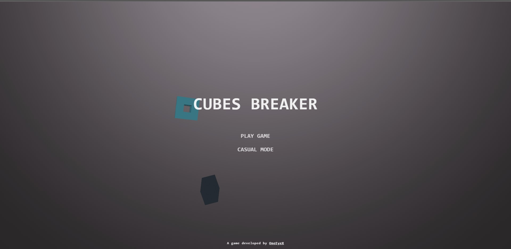

# Cube-Breaker
Cube Breaker is a game in which the player breaks cubes with a blade controlled via the mouse swipe (PC) or the touch screen (phone or tablet). As the cube is thrown onto the screen, the player swipes their mouse (PC) or finger (phone or tablet) across the screen to create a slicing motion, attempting to break the cube.
# You can TRY this game from the following link : https://oneeyex.github.io/Cube-Breaker-By-OneEyeX/
# You can PLAY this game on your PC or on your mobile devices (tablet or phone).

# Game screenshots from PC:

# Game screenshots from a mobile device:

